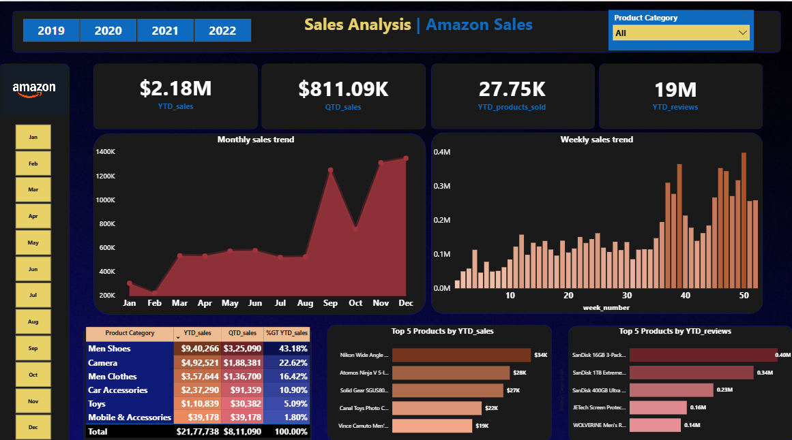

# Amazon Sales Analysis – Power BI Practice Project

## Project Overview

This project focuses on analyzing Amazon sales data using Microsoft Power BI Desktop to identify sales trends, product category performance, and key business insights over time.

The project was developed as a data analytics practice project with an emphasis on data visualization, KPI analysis, trend analysis, and business-oriented storytelling.

---

## Business Objective

The primary objective of this project is to analyze Amazon sales performance and identify:

- Overall sales trends over time
- Performance across different product categories
- High-performing and low-performing categories
- Changes in sales contribution across time
- Key patterns that can support business decision-making

---

## Tools & Technologies

- **Power BI Desktop** – Data visualization and dashboard development
- **DAX** – Measures and calculations
  

---

## Dataset

The project uses an Amazon sales dataset containing sales-related information across different product categories and time periods.

The dataset was imported into Power BI and prepared for analysis using Power Query before creating the dashboard.

---

## Analysis Performed

The analysis focuses on:

- Sales performance over time
- Category-wise sales analysis
- Trend identification
- Comparative performance analysis
- KPI-based performance monitoring
- Interactive filtering and visual exploration

---

## Key Insights

The dashboard was used to identify differences in sales performance across product categories and observe how sales trends changed over time.

Detailed findings and observations from the analysis are documented in the accompanying Power BI report PDF.

---

## Dashboard Preview

---

## Project Files

| File | Description |
|------|-------------|
| `Amazon Sales Dashboard-Power BI Practice.pbix` | Power BI Desktop dashboard file |
| `Amazon Sales Power BI Report-Practice.pdf` | PDF report containing the analysis and findings |
| `Amazon_data.xlsx` | Source dataset used for the analysis |
| `Amazon_sales_dashboard.png` | Dashboard preview image |
| `README.md` | Project documentation |

---

## Project Outcome

This project provided practical experience in:
- Power BI dashboard development
- DAX-based calculations
- Data visualization
- Trend analysis
- Category-level performance analysis
- Converting raw data into business-oriented insights

---

## Author

**Poojan Thakkar**

Aspiring Data Analyst | Power BI | SQL | Excel | Python
